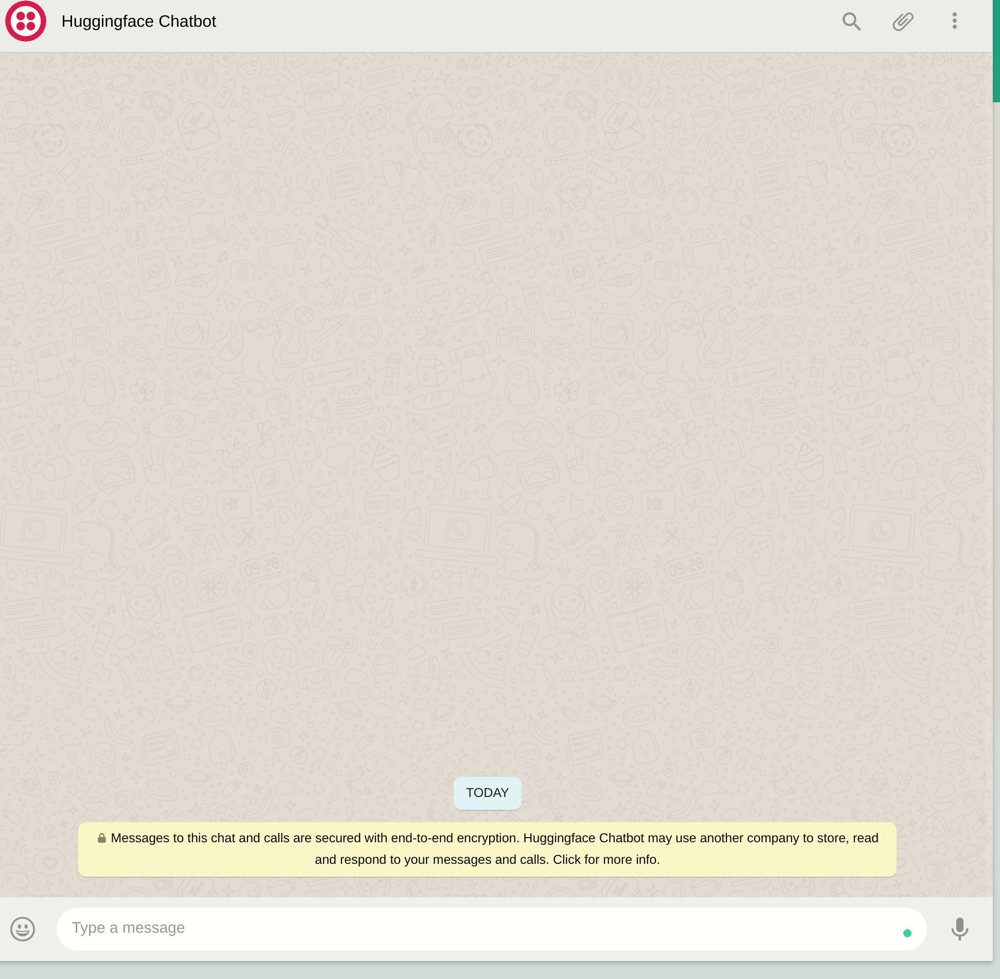

# :fire::fire: Empowering-WhatsApp-with-an-Integrated-Chatbot-API :fire::fire:


Leveraged Microsoft's [DialoGPT](https://huggingface.co/microsoft/DialoGPT-medium) dialogue response generation model by Microsoft to build a chatbot and integrate it with WhatsApp.



## Installation
* Clone the repo <br/>
`git clone https://github.com/Natenaile/Empowering-WhatsApp-with-an-Integrated-Chatbot-API.git`
* To Install all requirements run
```
pip install -r requirements.txt
sudo snap install ngrok
```

## Want to give the chatbot a try?
1. follow the steps in the installation section.
2. run `python bot.py --help`
3. run `ngrok http 5000` in the terminal.
4. copy the first forwarding url in the “When a message comes in” field in [Twilio Sandbox](https://www.twilio.com/console), add `/bot` at the end 
of the url to direct the flask app to the Bot function. <br/>

5. Hit Save
6. Start Chatting !!

## Acknowledgements
[Twilio](https://www.twilio.com/blog/build-a-whatsapp-chatbot-with-python-flask-and-twilio) tutorial.